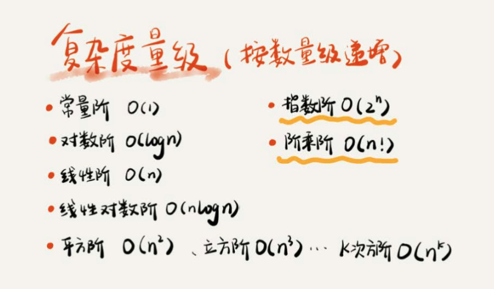
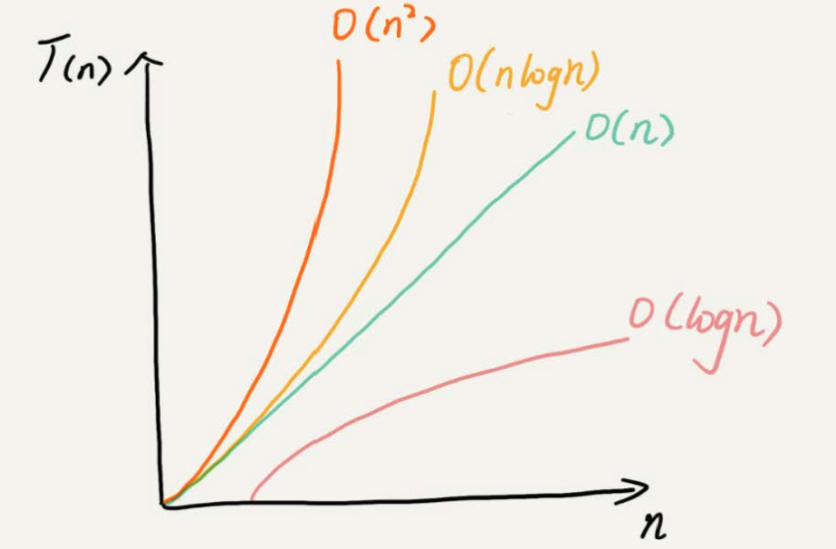
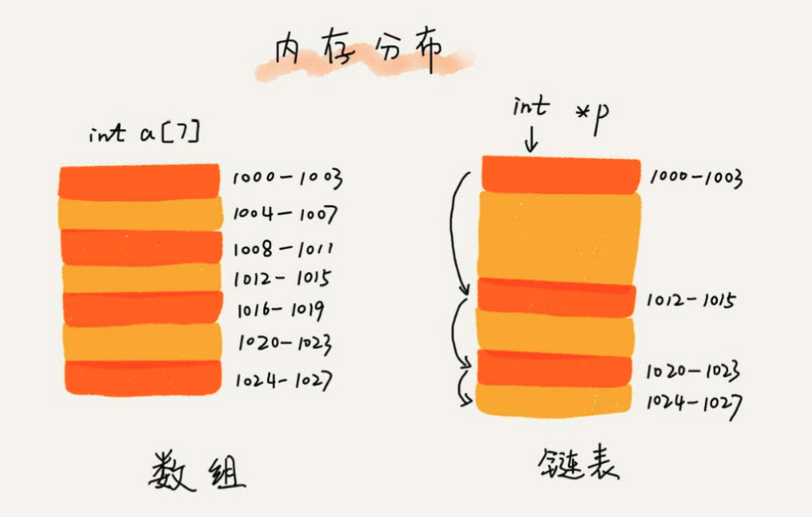
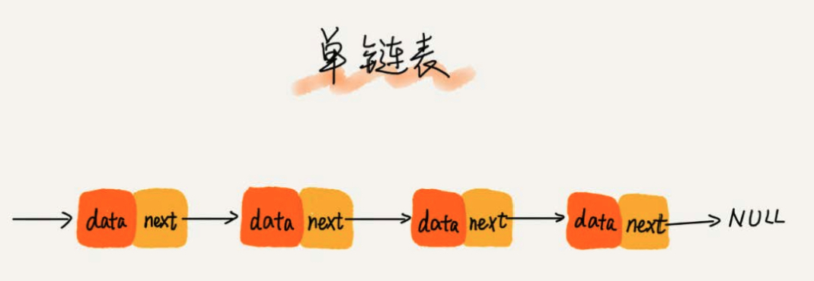
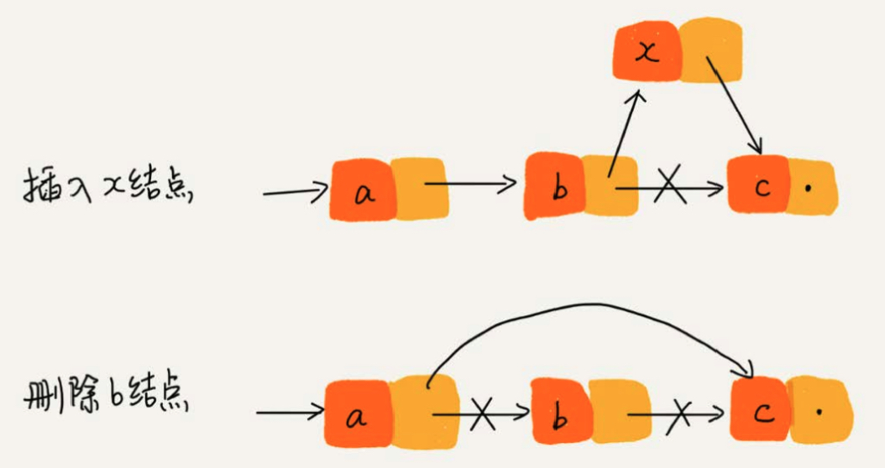
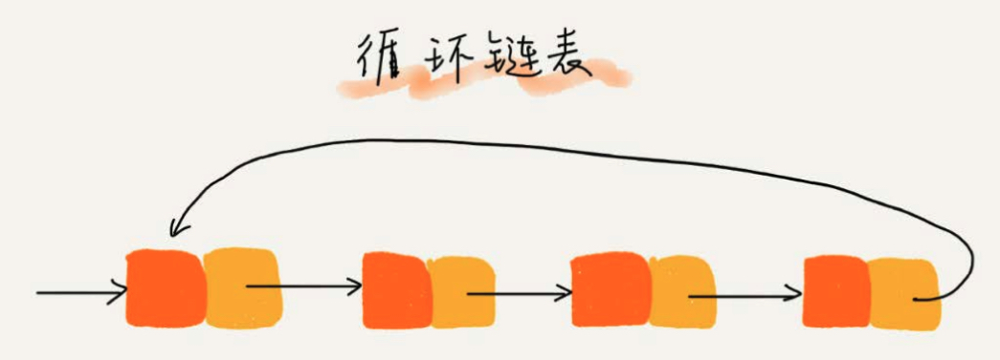
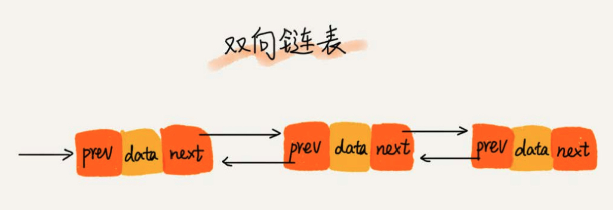
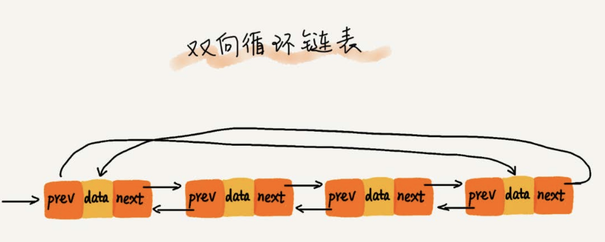
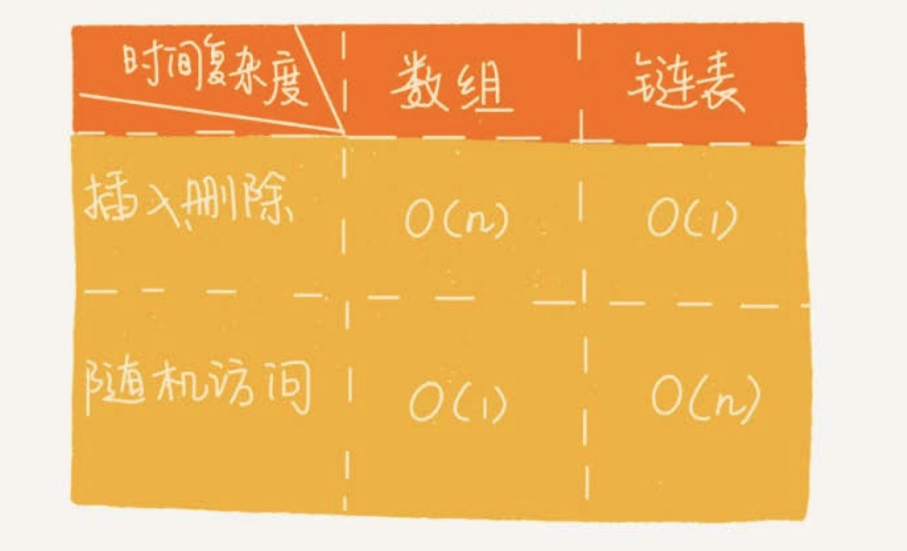
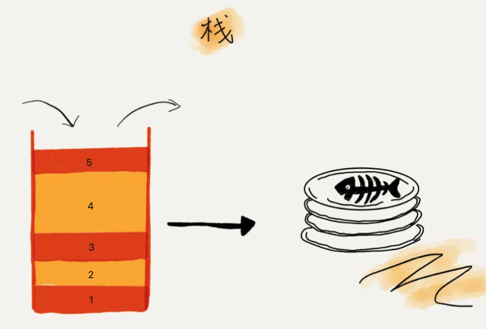

# 复杂度
## 时间负责度

### 最好情况时间复杂度

### 最坏情况时间复杂度

### 平均情况时间复杂度

### 均摊时间复杂度

### 数组

数组(Array)是一种线性表数据结构。它用一组连续的内存空间，来存储一组具有相同类型的数据。

数组的插入、删除操作时，为了保持内存数据的连续性，需要做大量的数据搬移，所以时间复杂度是O(n)。

### 链表

内存分布

#### 单链表

在链表中插入或者删除一个数，只需要考虑相邻结点的指针改变，所以对应的时间复杂度是O(1)

链表随机访问性能没有数组好，需要 O(n) 的时间复杂度。

#### 循环链表

#### 双向链表

双向链表需要额外的两个空间存储后继节点和前驱节点的地址，但可以支持双向遍历。

从结构上看，双向链表可以支持 O(1) 时间复杂度的情况下找到前驱节点，再某些情况下插入、删除等操作都要比单链表简单、高效。

#### 双向循环链表

#### 链表 VS 数组

### 栈

### 