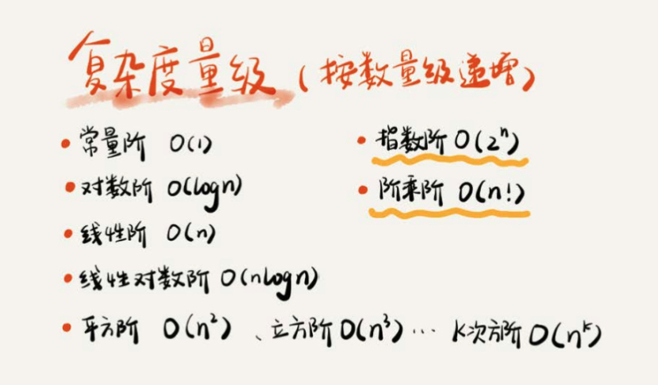
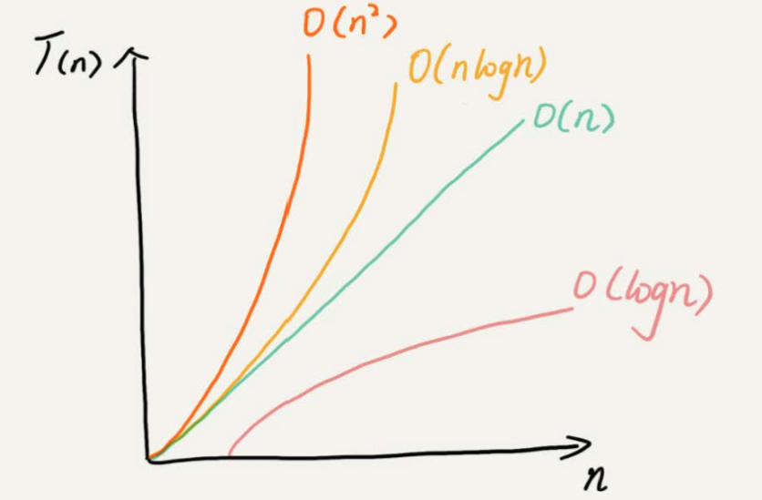
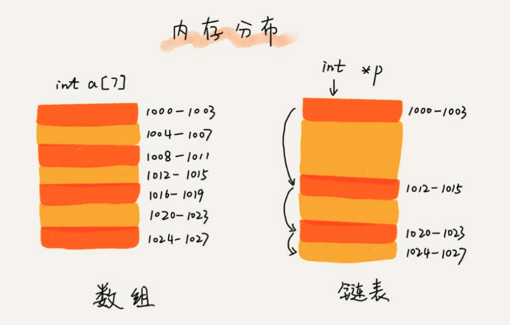
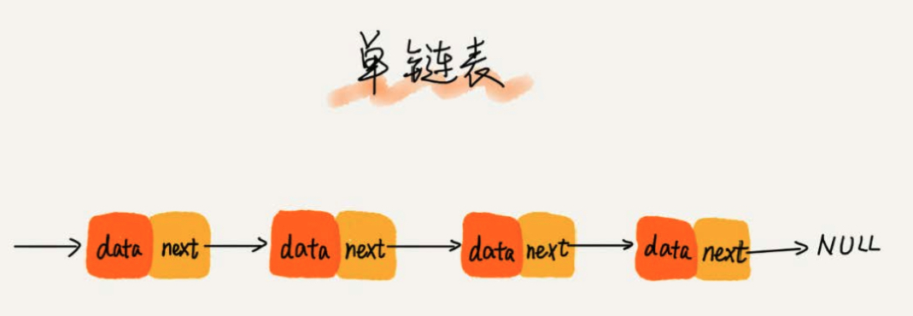
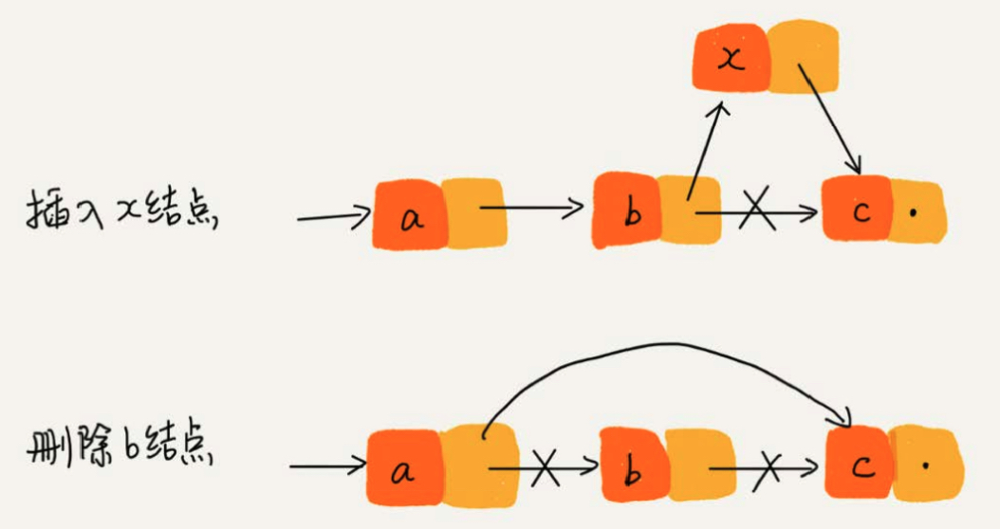
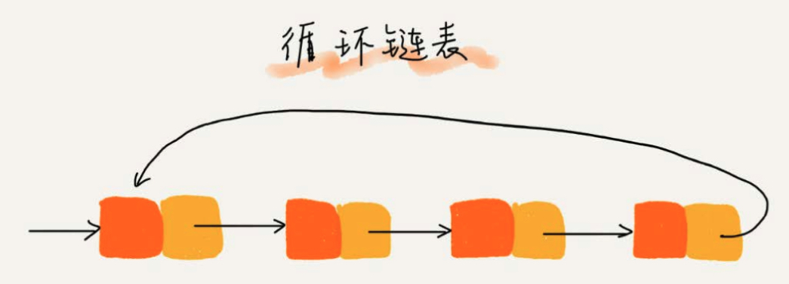
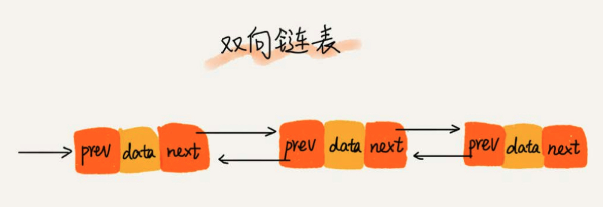
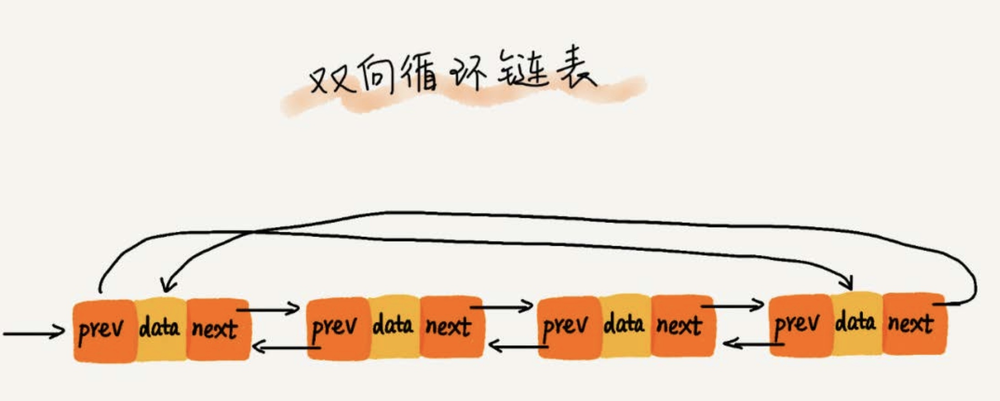
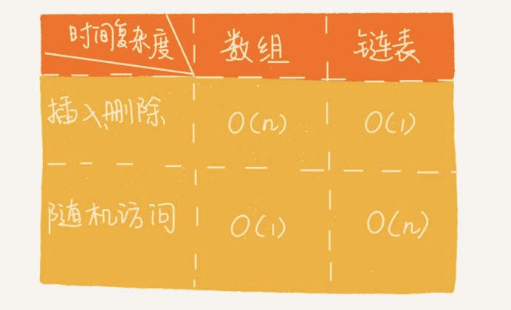
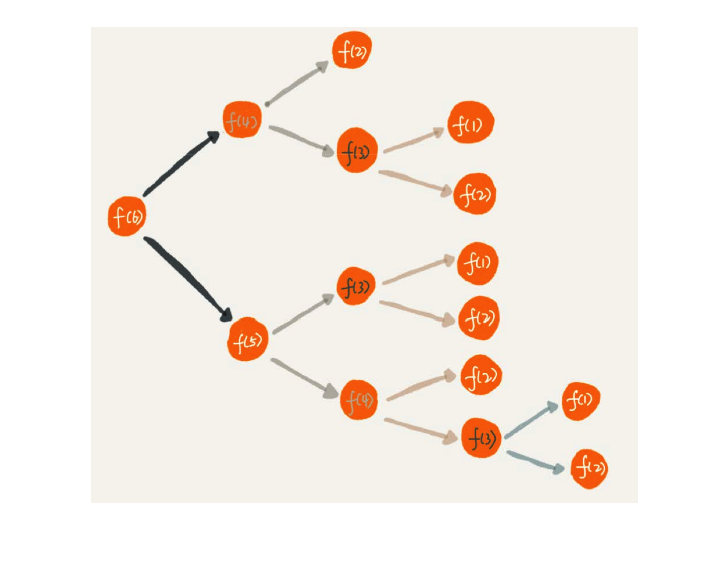

# 复杂度
## 时间负责度




### 最好情况时间复杂度

### 最坏情况时间复杂度

### 平均情况时间复杂度

### 均摊时间复杂度

### 数组

数组(Array)是一种线性表数据结构。它用一组连续的内存空间，来存储一组具有相同类型的数据。

数组的插入、删除操作时，为了保持内存数据的连续性，需要做大量的数据搬移，所以时间复杂度是O(n)。

### 链表

内存分布



#### 单链表



在链表中插入或者删除一个数，只需要考虑相邻结点的指针改变，所以对应的时间复杂度是O(1)



链表随机访问性能没有数组好，需要 O(n) 的时间复杂度。

#### 循环链表



#### 双向链表



双向链表需要额外的两个空间存储后继节点和前驱节点的地址，但可以支持双向遍历。

从结构上看，双向链表可以支持 O(1) 时间复杂度的情况下找到前驱节点，再某些情况下插入、删除等操作都要比单链表简单、高效。

#### 双向循环链表



#### 链表 VS 数组



### 栈


### 

### 递归

**递归需要满足三个条件：**

1. 一个问题可以分解为几个子问题的解
2. 这个问题与分解后的子问题，除了数据规模不同，求解思路完全一样
3. 存在递归终止条件

**如何编写递归代码**

写递归代码最关键的是写递推公式，找到终止条件，剩下将递推公式转换为代码。

如果一个问题A可以分解为若干子问题B、C、D，可以假设子问题B、C、D 已经解决，在此基础上思路如何解决问题A。而且，只需要思路问题A与子问题B、C、D两层之间的关系即可，不需要一层一层往下思考子问题与子子问题，子子问题与子子子问题之间的联系。屏蔽掉递归细节，这样子理解起来就简单多了。

**递归代码要警惕堆栈溢出**

可以在代码中限制递归调用的最大深度的方式来解决堆栈溢出的问题。

```java
int depth = 0;
int fun(int n) {
  ++depth;
  if(depth > 1000) throw exception;
  if(n == 1) return 1;
  return fun(n -1) + 1;
}
```

如果深度比较小，可以使用这种方法。

**递归代码要警惕重复计算**



为了避免重复计算，可以通过一个数据结构（比如散列表）来保存已经求解过的 f(k)。

```java
public int fun(int n) {
  if(n == 1) return 1;
  if(n == 2) return 2;
  if(hasSolvedList.containsKey(n)) {
    return hasSolvedList.get(n);
  }
  int ret = f(n-1) + f(n-2);
  hasSolvedList.put(n, ret);
  return ret;
}
```

**如何将递归代码改写成非递归代码？**

递归代码表达力强，非常简洁，但是空间复杂度高、有堆栈溢出分析、存在重复计算、过多函数调用会耗时较多问题。

比如：f(n) = f(n-1)+1

```java
int f(int n) {
  int ret = 1;
  for(int i = 2; i<= n; i++) {
    ret = ret +1;
  }
  return ret;
}
```
