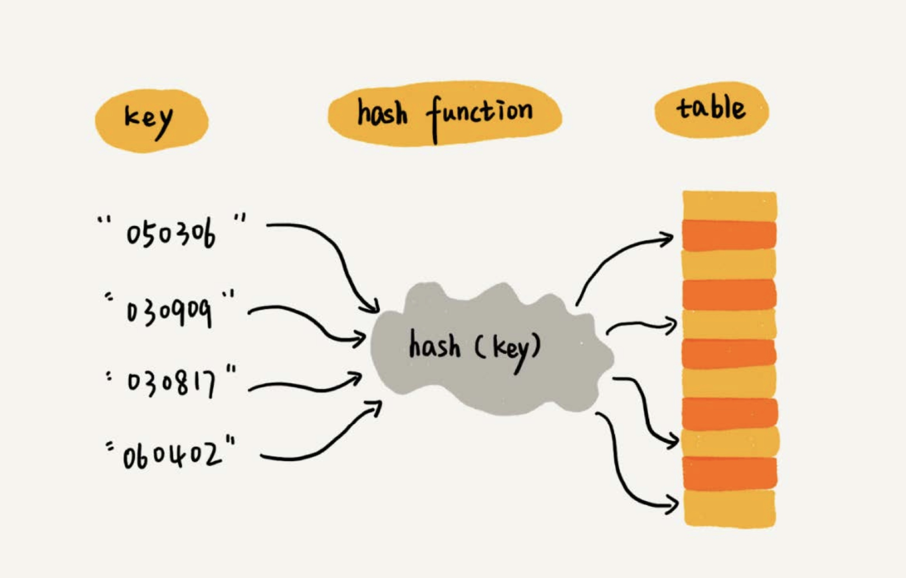
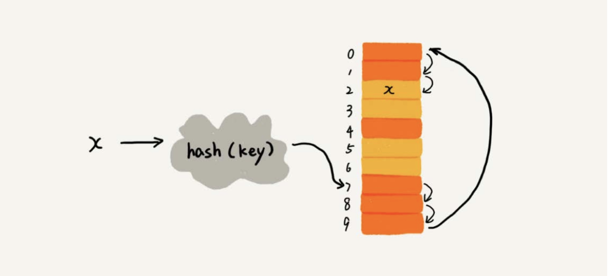
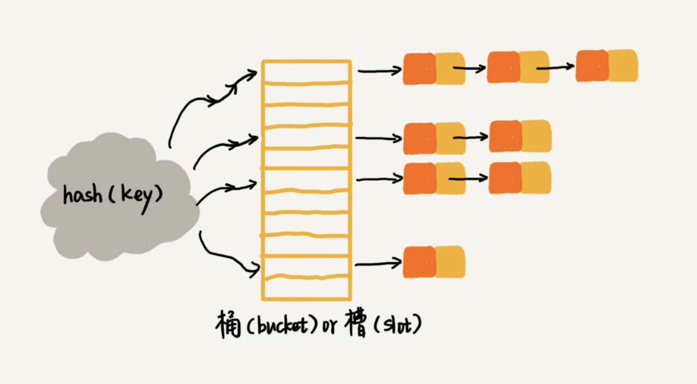
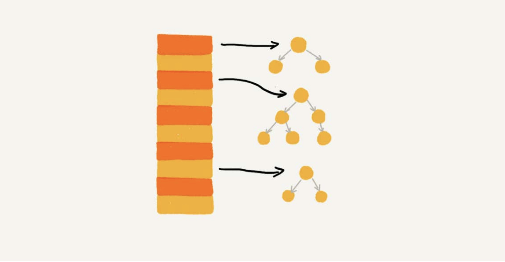
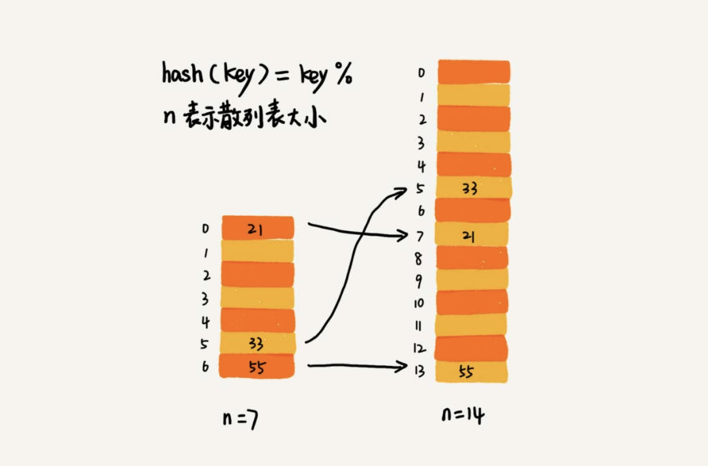
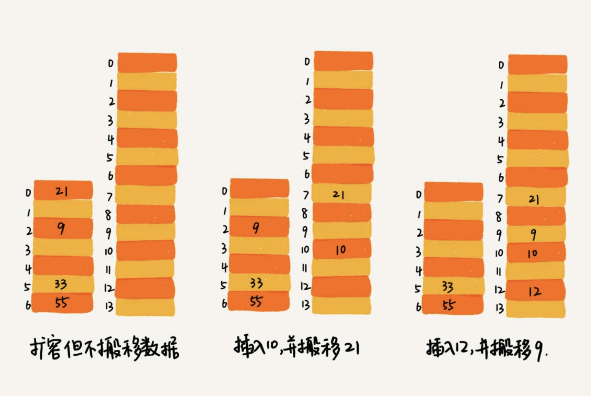

# 散列表

散列表用的就是数组支持按照下标随机访问的时候，时间复杂度是 O(1) 的特性。通过散列函数把元素的键值映射为下标，然后将数据存储在数组中对应下标的位置。
当按照键值查询元素时，用同样的散列函数，将键值转化为数组下标，从对应的数据下标的位置取数据。



### 散列函数

可以定义为 `hash(key)` ，其中 key 表示元素的键值，`hash(key)` 的值表示经过散列函数计算得到的散列值。

散列函数设计的基本要求：

1. 散列函数计算得到的散列值是一个非负整数；
2. 如果 key1 = key2，那 hash(key1) == hash(key2);
3. 如果 key1 != key2，那 hash(key1) != hash(key2);

要想找到一个不同的 key 对应的散列值都不一样的散列函数，几乎是不可能的，因为数组的存储空间有限，会加大散列冲突的概率。

### 散列冲突

> Java中LinkedHashMap就采用了链表发解决冲突，ThreadLocalMap 是通过线性探测的开放寻址法来解决冲突。

#### 1. 开放寻址法

核心思想是如果出现了散列冲突，就重新探测一个空闲位置，将其插入。

**线性探测(Linear Probing)**

当往散列表中插入数据时，如果某个数据经过散列函数之后，存储位置已经被占用，就从当前位置开始，依次往后查找，看是否有空闲位置，直到找到为止。



优点：

* 散列表中的数据都存储在数组中，可以有效地利用CPU缓存加快查询速度
* 序列化简单

缺点：

* 删除数据的时候比较麻烦，需要特殊标记已经删除掉的数据
* 当散列表中插入的数据越来越多时，散列冲突发生的可能性会越来越大，空闲位置也会越来越少，线性探测的时间也会越来越久。
* 极端情况下，可能需要探测整个散列表，最坏情况时间复杂度为 O(N)。
* 使用开放寻址解决冲突的散列表，装载因子的上限不能太大，这也导致这种方法比链表法更浪费内存空间。


总结：当数据量比较小、装载因子小的时候，适合采用开放寻址法。这也是Java中的ThreadLocalMap使用开放寻址法解决散列冲突的原因。

> 二次探测(Quadratic probing)、双重探测(Double probing)
> 线性探测步长是 1 ，它探测的下标序列是 hash(key) + 1，hash(key) + 2 ... ，而二次探测的步长就变成了原来的"二次方"，它的探测下标就是 hash(key) + 0, hash(key) + 1²， hash(key) + 2²

> 所谓双重散列，意思就是不仅要使用一个散列函数。使用一组散列函数hash1(key)，hash2(key)，hash3(key)……先用第一个散列函数，如果计算得到的存储位置已经被占用，再用第二个散列函数，以此类推，直到找到空闲的存储空间。

无论用哪种探测方法，当散列表中空闲位置不多的时候，散列冲突的概率就会大大提高。为了尽可能保证散列表的操作效率，一般情况下，会尽可能保证散列表中有一定比例的空闲槽位，用装载因子(load factor)来表示空位多少。

装载因子的计算公式：

**散列表装载因子 = 填入表中的元素个数 / 散列表的长度**

装载因子越大，说明空闲位置越少，冲突越多，散列表的性能就会下降。

#### 2. 链表法

在散列表中，每个“桶（bucket）”或者“槽（slot）”会对应一条 链表法是种更加常用的散列冲突解决办法，相比开放寻址法，它



当插入元素的时候，只需要通过散列函数计算出对应的散列槽位，将其插入到对应链表中即可，插入时间复杂度O(1)。

当查找、删除一个元素时，只需要通过散列函数计算出对应的散列槽位，然后遍历链表查找或者删除。

这两个操作的时间复杂度跟链表的长度k成正比，也就是O(k)。对于散列比较均匀的散列函数来说，理论上讲，k=n/m，其中n表示散列中数据的个数，m表示散列表中"槽"的个数。

优点：

* 内存利用率较高
* 对大装载因子容忍度更高，只要散列函数的值随机均匀，即便装载因子变成10，也就是链表的长度变长了而已，虽然查找效率有所下降，但是比起顺序查找还是快很多。开放寻址法只能适用装载因子小于1的情况。

缺点：

* 链表要存储指针，所以对比较小的对象的存储，是比较消耗内存的。
* 链表中的节点是零散分布在内存中，不是连续的，所以对CPU缓存不友好。

> 实际上，我们对链表法稍加改造，可以实现一个更加高效的散列表。那就是，我们将链表法中的链表改造为其他高效的动态数据结构，比如跳表、红黑树。这样即使出现散列冲突，极端情况下，所有数据都在同一个桶里。那最终退化成的散列表查找时间也不过是 O(logn)。



总结：基于链表的散列冲突处理方法比较适合存储大对象、大数据量的散列表，而且，比起开放寻址法，它更加灵活，支持更多的优化策略，比如用红黑树代替链表。


### 如何设计散列函数

散列函数设计的好坏，决定了散列表冲突的概率大小，也直接决定了散列表的性能。

什么才是好的散列函数？

 * 设计不能太复杂，过于复杂的散列函数，势必会消耗很多计算时间
 * 散列函数生成的值尽可能随机并且均匀分布，这样才能避免或者最小化散列冲突，即使出现冲突，散列到每个槽里的数据也会比较平均，不会出现某个槽里的数据特别多的情况。

### 装载因子过大怎么办？

对于动态散列表来说，数据集合是频繁变动的，事先无法预估将要加入的数据个数，所有也无法申请一个足够大的散列表，随着数据慢慢加入，装载因子就会慢慢变大。

当装载因子大到一定程度，散列冲突就会变得不可接受。

针对散列表，当装载因子过大时，也可以进行动态扩容，重新申请一个更大的散列表，将数据搬移到这个新的散列表中。

针对数组的扩容，数据搬移操作比较简单。但是，针对散列表扩容，数据搬移操作就要复杂很多。因为散列表的大小变了，数据的存储位置也变了，所以需要通过散列函数重新计算每个数据的存储位置。



> 插入一个数据，最好情况下，不需要扩容，最好时间复杂度是O(1)。最坏情况下，散列表装载因子过高，启动扩容，我们需要重新申请内存空间，重新计算哈希位置，并且搬移数据，所以时间复杂度是O(n)。用摊还分析法，均摊情况下，时间复杂度接近最好情况，就是O(1)。


当散列表的装载因子超过某个阈值时，就需要进行扩容。装载因子阈值需要选择得当。如果太大，会导致冲突过多；如果太小，会导致内存浪费严重。


### 如何避免低效地扩容？

为了解决一次性扩容耗时过多的情况，我们可以将扩容操作穿插在插入操作的过程中，分批完成。当装载因子触达阈值之后，我们只申请新空间，但并不将老的数据搬移到新的散列表中。

当有新数据要插入时，我们将新数据插入新散列表中，并且从老的散列表中拿出一个数据放入到新散列表。每次插入一个数据到散列表，我们都重复上面的过程。经过多次插入操作之后，老的散列表中的数据就一点一点全部搬移到新散列表中了。



对于查询操作，为了兼容了新、老散列表中的数据，我们先从新散列表中查找，如果没有找到，再去老的散列表中查找。


### 工业级散列表举例分析 —— Java 中的 HashMap

#### 1. 初始大小

HashMap 默认的初始化大小是 16，如果事先知道数据量有多大，可以通过修改默认初始化大小，减少动态扩容的次数，大大提高HashMap性能

#### 2. 装载因子和动态扩容

最大装载因子默认是 `0.75`，当 HashMap 中元素超过 0.75 * capacity(capacity 表示散列表的容量)的时候，就会启动扩容，每次扩容都会扩容为原来的两倍大小。

#### 3. 散列冲突

HashMap 底层是采用链表法来解决冲突。即使装载因子和散列函数设计得再合理，也免不了会出现拉链过长的情况，一旦出现拉链过长，则会严重影响HashMap的性能。

> 在 JDK1.8 版本中，为了对HashMap做进一步优化，引入了红黑树。而当链表长度太长（默认超过8）时，链表就转换为红黑树。可以利用红黑树快速增删改查的特点，提高HashMap 的性能。
> 
> 当红黑树结点个数小于8时，又会将红黑树转换为链表。因为在数量较小的情况，红黑树要维护平衡，比起链表性能上优势并不明显。


#### 4. 散列函数

```Java
    static final int hash(Object key) {
        int h;
        return (key == null) ? 0 : (h = key.hashCode()) ^ (h >>> 16);
    }
```

hashCode()返回的是Java对象的hash code，比如String类型的对象的hashCode()

```Java
    public int hashCode() {
        int h = hash;
        final int len = length();
        if (h == 0 && len > 0) {
            for (int i = 0; i < len; i++) {
                h = 31 * h + charAt(i);
            }
            hash = h;
        }
        return h;
    }
```

#### 5. 总结：

> 何为一个工业级的散列表？工业级的散列表应该具有哪些特性？
> * 支持快速的查询、插入、删除操作；
> * 内存占用合理，不能浪费过多的内存空间；
> * 性能稳定，极端情况下，散列表的性能也不会退化到无法接受的情况。

> 如何实现这样一个散列表呢？
> * 设计一个合适的散列函数；
> * 定义装载因子阈值，并且设计动态扩容策略；
> * 选择合适的散列冲突解决方法。

