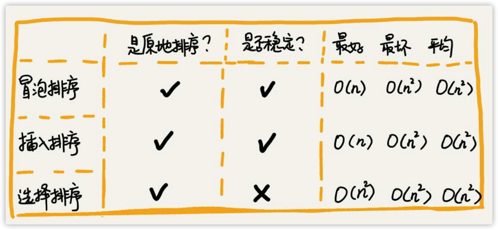

## 排序

### 排序



### 选择排序

1. 首先找到数组中最小的元素，将它和数组中第一个元素交换位置
2. 在剩下的元素中找到最小的元素，将它与数组的第二个元素交换位置
3. 如此反复，直到将整个数组排序

```java
public class Selection {
    public static void sort(int[] a) {
        for (int i = 0; i < a.length; i++) {
            int min = i;
            for (int j = i + 1; j < a.lenght; j++) {
                if (a[j] < a[min]) {
                    min = j;
                }
            }
            exch(a, i, min);
        }
    }
}
```

该算法将第 i 小的元素放到 a[i] 之中。数组的第 i 个位置的左边是 i 个最小的元素且他们不会再被访问。

### 插入排序

与选择排序一样，当前索引左边所有元素都是有序的，但它们的最终位置还不确定，为了给更小的元素腾出空间，他们可能会被移动。但是当索引到达数组的右端时，数组排序就完成了。

```java
public class Insertion {
    public void sort(int[] a) {
        for (int i = 1; i < a.length; i++) {
            for (int j = i; j > 0 && a[j] < a[j - 1]; j--) {
                exch(a, j, j - 1);
            }
        }
    }

    // 优化，将较大的元素右移一位
    public void sort(int[] a) {
        for (int i = 1; i < a.length; i++) {
            int curr = a[i];
            int j = i;
            for (; j > 0 && a[j - 1] > a[j]; j--) {
                a[j] = a[j - 1];
            }
            a[j] = curr;
        }
    }

    // 哨兵，先找出最小的元素并将它置于数组的最左边
    // 这样就可以去掉内循环的判断条件 j > 0
    public void sort(int[] a) {
        int min = 0;
        for (int i = 0; i < a.length; i++) {
            if (a[i] < a[min]) {
                min = i;
            }
        }
        exch(a, 0, min);

        for (int j = 1; j < a.length; j++) {
            int curr = a[j];
            int k = j;
            for (; a[k] < a[k - 1]; k--) {
                a[k] = a[k - 1];
            }
            a[k] = curr;
        }
    }
}
```

插入排序对于部分有序的数组十分高效。

### 归并排序

将两个有序的数组归并成一个更大的有序数组。

要将一个数组排序，可以先（递归地）将它分成两半分别排序，然后将结果归并起来。

时间复杂度 NlogN，空间复杂度 N

merge(a, lo, mid, hi) 将子数组 a[lo...mid] 和 a[mid+1...hi] 归并成一个有序的数组并将结果存放在a[lo...hi]中。

```java
public class Merge {


    public static void merge(int[] a, int lo, int mid, int hi) {
        int i = lo, j = mid + 1;
        for (int k = lo; k <= hi; k++) {
            aux[k] = a[k];
        }
        for (int k = lo; k <= hi; k++) {
            if (i > mid) a[k] = aux[j++];
            else if (j > hi) a[k] = aux[i++];
            else if (a[j] < a[i]) a[k] = aux[j++];
            else a[k] = aux[i++];
        }
    }
}
```

该方法先将所有的元素复制到 aux[] 中，然后再归并回 a[] 中。方法在归并时（第二个 for 循环）进行了 4
个判断：左半边用尽（取右半边的元素）、右半边用尽（取左半边）、右半边的当前元素小于左半边的当前元素（取右半边）、右半边的当前元素大于等于左半边的当前元素（取左半边的元素）。

#### 自顶向下的归并排序

```java
import geek.beauty.sort.Insertion;

public class Merge {

    private static int[] aux;

    public static void sort(int[] a) {
        aux = new int[a.length];
        sort(a, 0, a.length - 1);
    }

    private static void sort(int[] a, int lo, int hi) {
        if (hi <= lo) return;
        // 优化点
        // 1. 使用插入排序处理小规模的子数组（比如长度小于 15）一般可以将归并排序的运行时间缩短 10% ~ 15%。
        if (hi - lo <= 15) {
            Insertion.sort(a, lo, hi);
            return;
        }
        int mid = lo + (hi - lo) / 2;
        sort(a, lo, mid);           // 将左半边排序
        sort(a, mid + 1, hi);       // 将右半边排序
        // 优化点
        // 2. 可以增加一个判断条件，如果 a[mid] 小于等于 a[mid + 1]，我们就认为数组已经是有序的并跳过merge()方法。
        if (a[mid] > a[mid + 1])
            merge(a, lo, mid, hi);  // 归并结果
    }
}
```

归并排序所需的时间和 NlogN 成正比，可以处理数百万甚至更大规模的数组，这是插入排序或者选择排序做不到的。 主要缺点是辅助数组所使用的额外空间和 N 的大小成正比。

#### 自底向上的归并排序

先归并那些微型数组，然后再成对归并得到的子数组，如此这般，直到将整个数组归并在一起。

首先进行的是两两归并（把每个元素想象成一个大小为1的数组），然后是四四归并（将两个大小为2的数组归并成一个有4个元素的数组），然后是八八的归并，一直下去。

```java
public class MergeBu {
    private static int[] aux;

    public static void sort(int[] a) {
        int N = a.length;
        aux = new int[N];
        // 子数组的大小 sz 初始值为1，每次加倍
        // sz 表示先 1 1 归并
        // 然后 2 2 归并
        // 再   4 4 归并
        for (int sz = 1; sz < N; sz = sz + sz) {
            // 每次归并先从 0 位置开始
            // 下一个归并的区间开始的位置是 lo+=sz+sz
            for (int lo = 0; lo < N - sz; lo += sz + sz) {
                // 最后一次归并的第二个数组可能比第一个子数组要小
                merge(lo, lo + sz - 1, Math.min(lo + sz + sz - 1, N - 1));
            }
        }
    }
}
```

#### 快速排序

快速排序是原地排序，时间复杂度是O(NlogN)，空间复杂度为 O(1)，是一种分治的排序算法。它将一个数组分成两个子数组，将两部分独立地排序。

快速排序将数组排序的方式则是当两个子数组都有序时整个数组也就自然有序了。

```java
import edu.princeton.cs.algs4.StdRandom;

public class Quick {
    public static void sort(Comparable<?>[] a) {
        StdRandom.shuffle(a); // 消除对输入的依赖
        sort(a, 0, a.length - 1);
    }

    private static void sort(Comparable<?> a, int lo, int hi) {
        if (hi <= ho) return;
        int j = partition(a, lo, hi);
        sort(a, lo, j - 1);
        sort(a, j + 1, hi);
    }
}
```

快速排序递归地将子数组 a[lo...hi] 排序，先用 partition() 方法将 a[j] 放到一个合适的位置，然后再用递归调用将其他位置的元素排序。

该方法的关键在于切分，这个过程使得数组满足下面三个条件：

1. 对于某个 j，a[j] 已经排定；
2. a[lo] 到 a[j-1] 中的所有元素都不大于 a[j];(<=a[j])
3. a[j+1] 到 a[hi] 中的所有元素都不小于 a[j];(>=a[j])

实现方法：

1. 先随意地取a[lo]作为切分元素，即那个将会被排定的元素；
2. 然后从数组的左端开始向右扫描直到找到一个大于等于它的元素；
3. 再从数据的右端开始向左扫描直到找到一个小于等于它的元素；
4. 这两个元素显然是没有排定的，因此交换它们的位置；
5. 如此继续，就可以保证左指针 i 的左侧元素都不大于切分元素，右指针 j 的右侧元素都不小于切分元素；
6. 当两个指针相遇时，只需要将切分元素 a[lo] 和左子数组最右侧的元素(a[j])交换然后返回 j 即可。

```java
private static int partition(Comparable[] a, int lo, int hi) {
    int i = lo, j = hi + 1;
    Comparable v = a[lo];
    while(true) {
        while(less(a[++i], v)) if(i == hi) break;
        while(less(v, a[--j])) if(j == lo) break;
        if(i >= j) break;
        exch(a, i, j);
    }
    exch(a, i, j);  // 将 v = a[j] 放入到正确位置
    return j;       // a[lo...j-1] <= a[j] <= a[j+1...hi] 达成
}
```

### 快速排序算法改进

#### 切换到插入排序

* 对于小数组，快速排序比插入排序慢；
* 因为递归，快速排序的 sort() 方法在小数组中也会调用自己

因此，在排序小数组时应切换到插入排序

```java
if(hi<=lo+M){Insertion.sort(a,lo,hi);return;}
```

转换参数 M 的最佳值是和系统相关的，但是 5~15 之间的任意值在大多数情况下都能令人满意。

#### 三取样切分

#### 熵最优的排序

在有大量重复元素的情况下，快速排序的递归性会使元素全部重复的子数组经常出现，一个简单的想法就是将数组切为三部分，分别对应小于、等于和大于切分元素的数组元素。

> 它从左到右遍历数组一次，维护一个指针`lt`使得`a[lo..lt-1]`中的元素都小于`v`，一个指针`gt`使得`a[gt+1..hi]`中元素都大于`v`，一个指针`i`使得`a[lt..i-1]`中的元素都等于`v`，`a[i..gt]`中的元素都还未确定。
> 一开始`i`和`lo`相等，对`a[i]`进行三向比较
> * a[i] 小于 v，将 a[lt] 和 a[i] 交换，将 lt 和 i 加一；
> * a[i] 大于 v，将 a[gt] 和 a[i] 交换，将 gt 减一；
> * a[i] 等于 v，将 i 加一。
>
> 这些操作都会保证数组元素不变且缩小 gt-i 的值（这样循环才会结束）。

#### 三向切分的开始排序

```java
public class Quick3Way {
    private static void sort(Comparable<?>[] a, int lo, int hi) {
        if (hi <= lo) return;
        int lt = lo, i = lo + 1, gt = hi;
        Comparable<?> v = a[lo];
        while (i <= gt) {
            int cmp = a[i].compareTo(v);
            if (cmp < 0) exch(a, lt++, i++);
            else if (cmp > 0) exch(a, gt--, i);
            else i++;
        } // 现在 a[lo..lt-1] < v = a[lt..gt] < a[gt+1..hi] 成立
        sort(a, lo, lt - 1);
        sort(a, gt + 1, hi);
    }
}
```

这段排序的切分能够将切分元素相等的元素归位，这样他们就不会被包含在递归调用处理的子数组之中了。

这对于存在大量重复元素的数组，这种方法比标准的快速排序的效率高得多。
