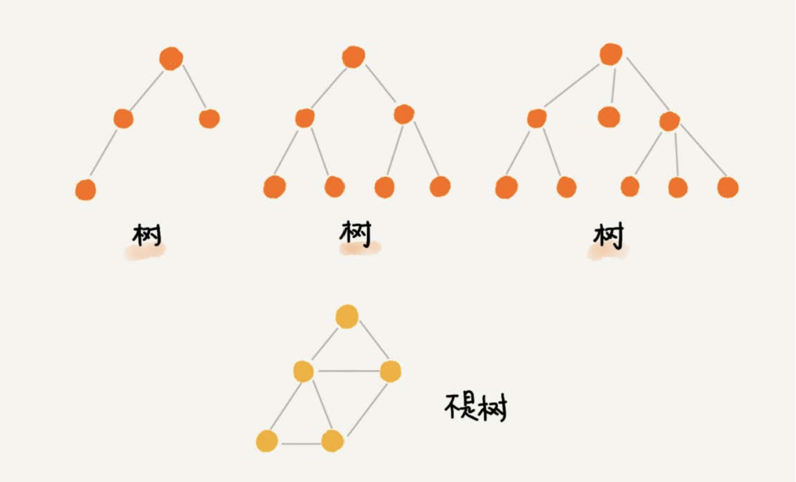
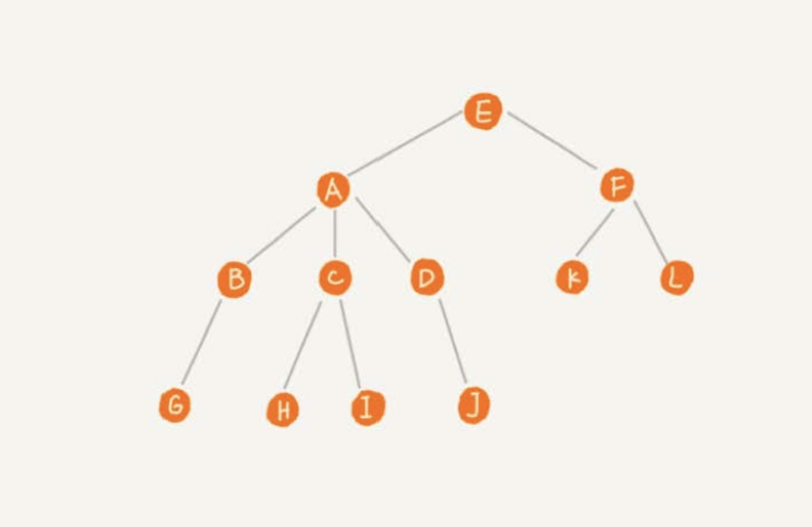
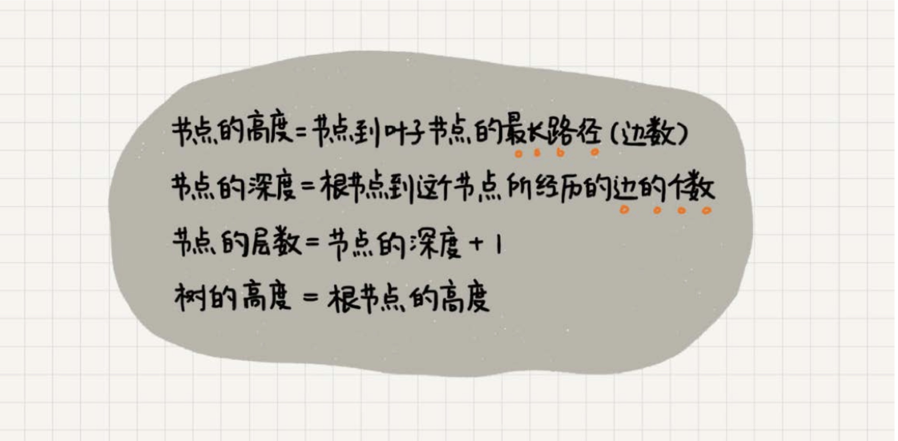
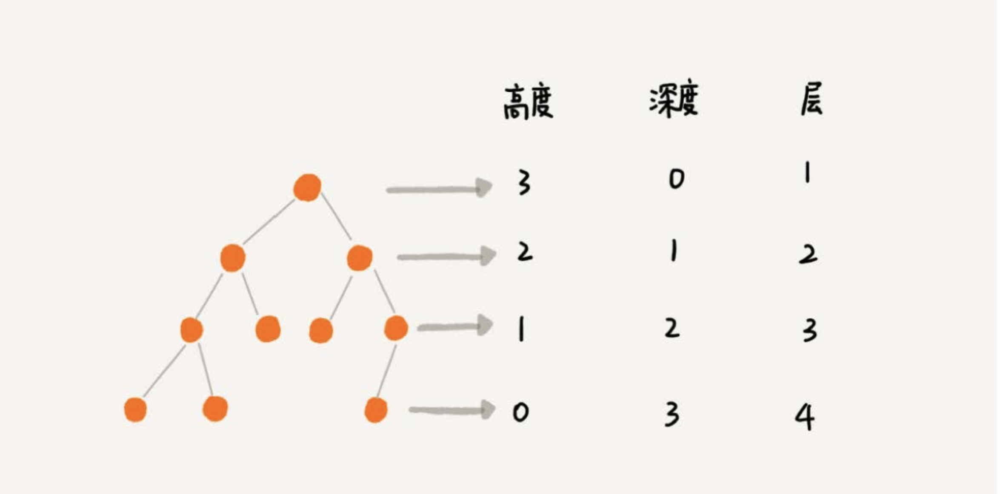
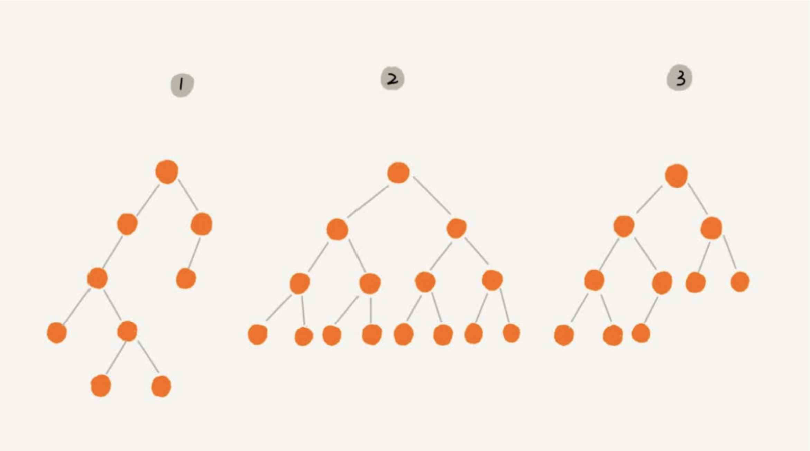
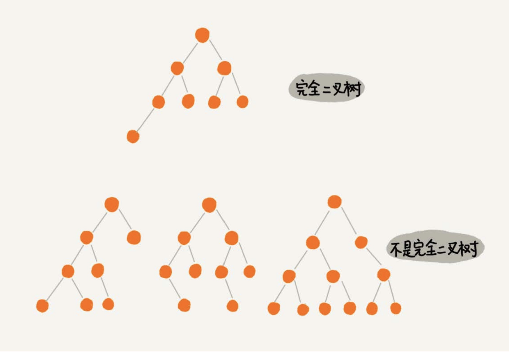
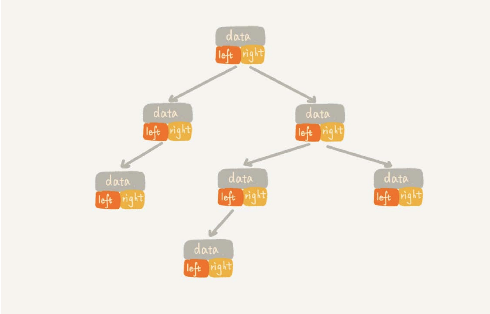
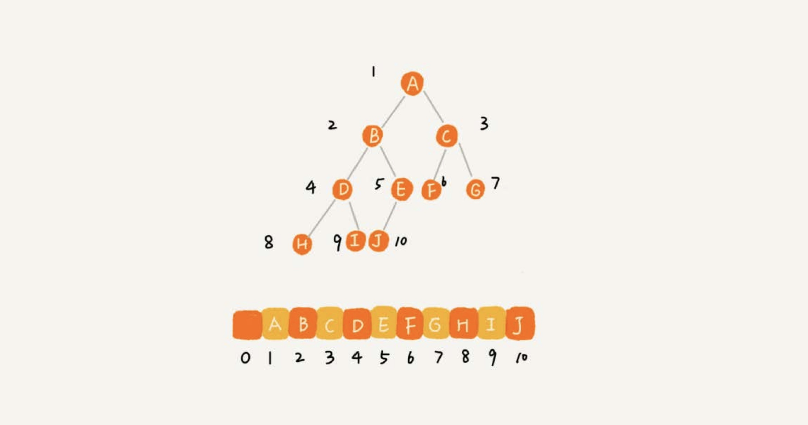
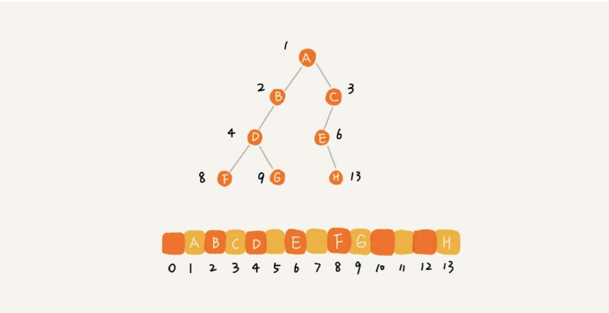
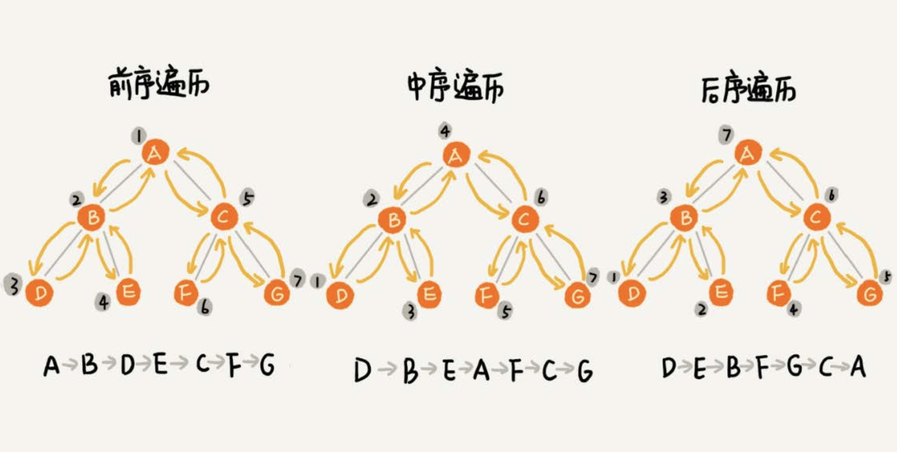

# 树 (Tree)

### "树"有什么特征？



这里每个元素叫做"节点"，用来连接相邻节点之间的关系，叫做"父子关系"。




A节点就是B节点的父节点，B节点是A节点的子节点。B、C、D这三个节点的父节点是同一个节点，它们之间互称为兄弟节点。

> 把没有父节点的节点叫作跟节点，也就是图中E节点；把没有子节点的节点叫作叶子节点或者叶节点，比如G、H、I、J、K、L都是叶子节点。

除此之外，关于“树”，还有三个比较相似的概念：高度（Height）、深度（Depth）、层（Level）。它们的定义是这样的：





* "高度"从下往上度量，从最底层开始数，并且计数的起点是0；
* "深度"从跟节点开始度量，并且计数起点也是0；
* "层数"跟深度计算类似，不过计数起点是1，也就是根节点位于第1层。

### 二叉树 (Binary Tree)

二叉树：每个节点最多有两个"叉"，也就是两个子节点，左子节点和右子节点。不过并不要求每个节点都有两个子节点，有的节点只有左子节点，有的节点只有右子节点。



编号2的二叉树，叶子节点全都在最底层，除了叶子节点之外，每个节点都有左右两个子节点，这种二叉树叫做满二叉树。

编号3的二叉树，叶子节点都在最底下两层，最后一层的叶子节点都靠左排列，并且除了最后一层，其他层的节点个数都要达到最大，这种二叉树叫做完全二叉树。



存储一棵二叉树，有两种方法，一种是基于指针或者引用的二叉链式存储法，一种是基于数组的顺序存储法。

**链式存储法**




**数组的顺序存储法**

把根节点存储在下标 `i=1` 的位置，那左子节点存储在下标 `2*i=2` 的位置，右子节点存储在 `2*i+1=3` 的位置，以此类推。



如果节点X存储在数组下标为`i`的位置，下标`2*i`的位置存储的是左子节点，下标`2*i+1`的位置存储的就是右子节点。

反过来，下标为`i/2`的位置存储的就是它的父节点，通过这种方式，只要知道根节点存储的位置（一般根节点存储下标为1的位置），就可以通过下标计算，把整颗树都串起来。

一棵完全二叉树，仅仅“浪费”了一个下标为0的存储位置。如果是非完全二叉树，其实会浪费比较多的数组存储空间。



> 如果某棵二叉树是一棵完全二叉树，那用数组存储无疑是最节省内存的一种方式。因为数组的存储方式并不需要像链式存储法那样，要存储额外的左右子节点的指针。
> 这也是为什么完全二叉树会单独拎出来的原因，也是为什么完全二叉树要求最后一层子节点都靠左的原因。

### 二叉树的遍历

* 前序遍历：对于树中的任意节点来说，先打印这个节点，然后打印它的左子树，最后打印它的右子树。
* 中序遍历：对于树中的任意节点来说，先打印它的左子树，然后打印它本身，最后打印它的右子树。
* 后续遍历：对于树中的任意节点来说，先打印它的左子树，然后打印它的右子树，最后打印这个节点本身。



> 实际上，二叉树的前、中、后序遍历就是一个递归的过程。比如，前序遍历，其实就是先打印根节点，然后再递归地打印左子树，最后递归地打印右子树。

> 写递归代码的关键，就是看能不能写出递推公式，而写递推公式的关键就是，如果要解决问题A，就假设子问题B、C已经解决，然后再来看如何利用B、C来解决A。

前序遍历递归公式：
```
preOrder(r) = print(r) -> preOrder(r->left) -> preOrder(r->right)
```

中序遍历递归公式：

```
inOrder(r) = inOrder(r->left) -> print(r) -> inOrder(r->right)
```

后序遍历递归公式：

```
postOrder(r) = postOrder(r->left) -> postOrder(r->right) -> print(r)
```

